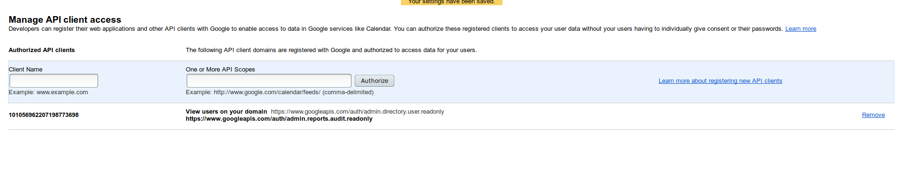

# Consuming and validating GSuites Audit Push notification on AppEngine

Google Cloud's primary identity-of-record is google-based.  That is, either @gmail or gsuites logins are used in the Authentication step and is the 
basis for GCP's IAM systems.

For Enterprise Gsuites-GCP customers, its  necessary to track gsuites user events such as group membership changes for individual users and possibly
apply remediations if the change is against policy.  This is quite important with GCP where IAM roles can be assigned to group and carries permissions to 
resources that are assigned.  For example, if i'm the owner of a group that currently has IAM access to a resource, I can add Alice to it that unilaterally and
thereby give access.

It would be nice to have a rules-based workflow that prevents arbitrary mutating group memebership and users.  While there are tools like [Forseti Security](https://forsetisecurity.org/docs/howto/configure/gsuite-group-collection.html), it periodically scans and applies policies.  Essentially, this is polling.

WHat if we could setup webhooks for these events?

Well, you can configure GSuites to emmit activity changes to a webhook destination in response to any group/user or gsuites object mutation.  This repo is a sample GAE app which accepts audit changes on a given gsuites domain via webhook notificaiton.  The sample app also tries to independently verify the provided webhook changes by running a query againts the actual suties domain.

The steps outlined below trace setting up the webhook notificaiton for GSuites changes into a GAE (Google AppEngine) application.  The AppEngine application inturn can check the validity of the webhook call by independently making another API call ..(afater that, it can) apply GSuites polcicies if it needs to get corrected)


## Outline 

The procedure here is extensive so I've provided an outline of what steps this article describes.

You need to be the Gsuites Domain Admin for this to work since we need to enable notification and registration of the webhook callback.

The overall steps described here:

* Enable webhook callback URL (Domain Verification)

* GSuites
  * Register WebHook callback URL
  * Configure API access and scope for GAE's ClientID

* Configure GAE
  * Enable "domain wide delegation" for  GAE service Account
  * Determine ClientID for GAE service account
  * Set Service Account Token IAM role to GAE's service Account

## Prerequsites

You should setup the following prior to attempting this procedure:

- Python on local workstation (with ```virtualenv```)
- Gsuites Domain Admin: you should be the GSuites domain admin.
- [WebMaster tools](https://www.google.com/webmasters/tools/home): you should have access to the WebMaster tools for the domain 

## References

Some additional resources to consider:

- [Google Cloud Identity](https://support.google.com/cloudidentity/answer/7319251?hl=en)
- [Forset Security](https://forsetisecurity.org/docs/howto/configure/gsuite-group-collection.html)
- [Directory API Domain-wide Delegation](https://developers.google.com/admin-sdk/directory/v1/guides/delegation)
- [Admin SDK QuickStart](https://developers.google.com/admin-sdk/reports/v1/quickstart/python)
- [Admin SDK Push Notification](https://developers.google.com/admin-sdk/reports/v1/guides/push)
- [Admin SDK Activies Endpoint](https://developers.google.com/admin-sdk/reports/v1/reference/activities/list)
- [GSuites Domain-wide Delegation](https://developers.google.com/identity/protocols/OAuth2ServiceAccount#delegatingauthority)
- [Using serviceAccountActor IAM role for account impersonation](https://medium.com/google-cloud/using-serviceaccountactor-iam-role-for-account-impersonation-on-google-cloud-platform-a9e7118480ed)

---

## 1 Webhook callback

The first step is to setup the webhook callback url to a GAE endpoint.  TO do this step, you need to be the GSuites Admin and have access
to webmaster tools.  I used the same login for both in the procedure below so the flow became a lot easier.

The specs that I've registered here is: 
- GCP ProjectiD: ```fabled-ray-104117```
- Push Notification URL: ```https://fabled-ray-104117.appspot.com/push```
- GSuites Domain: ```esodemoapp2.com```
- GAE Service Account: ```fabled-ray-104117@appspot.gserviceaccount.com```
  - Service Account ClientiD: ```101056962207198773698```

### 1.1 WebMaster tools

First step is to verify you're the domain admin and setup Web Master tools to point to an App Engine URL.  As the domain admin, goto

- [https://www.google.com/webmasters/verification/details](https://www.google.com/webmasters/verification/details)
- - or if you have the projectID: ```https://www.google.com/webmasters/verification/details?hl=en&theme=wmt&siteUrl=https://YOUR_APP_ID.appspot.com```

now Register Domain
```https://fabled-ray-104117.appspot.com/```

WMT may ask you to pick a verification mechanism.  The easiest would be to download a verificaiton file.  In the example here, my verification file is:
 -  ```google1a34ceec516c662e.html```


### 1.2 Deploy GAE application to verify domain

Now that we've got the verificaito file, we can upload it as a static file to GAE as verification.
The easiest is to deploy a test applicaiton with one modification:  set a static file handler:

So, 
- download the sample 'hello-world' python GAE App here:
  - [https://github.com/GoogleCloudPlatform/python-docs-samples/tree/master/appengine/standard/hello_world](https://github.com/GoogleCloudPlatform/python-docs-samples/tree/master/appengine/standard/hello_world)
- Copy the downloaded static file to the root of the ```hello-world``` application
- set a handler in ```app.yaml```:
    ```yaml
    handlers:
    - url: /google1a34ceec516c662e.html
      static_files: google1a34ceec516c662e.html
      upload: google1a34ceec516c662e.html
    ```
(ofcourse your static html file will be something different!)

- Deploy the GAE application:
  -  ```gcloud app deploy app.yaml --version 1 ```
 
- Click ```Verify``` in WebMaster tools.
  WMT will attempt to contact ```https://yourappID.appspot.com/yourverificaitonfile.html``` to check for that file signature


### 1.3 GCP Cloud Console

You need to select a GCP project to enable webhook callbacks and to deploy the GAE applicaiton.

On that project, navigate to the [Domain Verificaiton](https://console.cloud.google.com/apis/credentials/domainverification) page and register
```yourProjectID.appspot.com``` (no ```https://``` or trailing ```/```).

At this point, you should see:


You should also enable ```iam``` and ```appengine``` for this project:
```
$ gcloud services enable iam.googleapis.com
$ gcloud services enable appengine.googleapis.com
```

## 2 Configure Deploy GAE to make GSuites Admin API calls

Now that we've registeed the callback url, we need to configure GAE to allow it to make GSuites API calls.


### 2.1 Setup Service Account Token Creator IAM role

Normally, Google Compute Engine and AppEngine generates its own identity tokens.  This particular token has predefined and static
[scopes](https://cloud.google.com/compute/docs/access/create-enable-service-accounts-for-instances#changeserviceaccountandscopes) you can 
set which does _NOT_ include the ones needed for GSuites [directory_v1](https://developers.google.com/apis-explorer/#search/watch/m/admin/directory_v1/directory.users.watch) or [reports_v1](https://developers.google.com/apis-explorer/#p/admin/reports_v1).  Moreover, the ```directory_v1``` requires a spcecific format for its token
that allows for delegation as described :
- [delegating authority](https://developers.google.com/api-client-library/python/auth/service-accounts#delegatingauthority)
- [directory API](https://developers.google.com/admin-sdk/directory/v1/quickstart/python)

We need to find an alternative mechanism to acquire an appropriate token from Appengine.  The specific trick we can emply here is to allow GAE's service
account to _self-delegate_ itself to mint a new token.  What?  Well, GCP allows users and other service accounts to act on its own behalf to do certain.  The specific capability we will employ here is [Service Account Token Creator](https://cloud.google.com/iam/docs/service-accounts#the_service_account_token_creator_role) which allows a service account A to impersonate B.  

However, what we are doing here is allowing GAE's service account to impersonate itself. (why?)...We are doing that here since we now have the capability to 
mint a **NEW** ```access_token``` for GAE that is unrestricted.  That is, we will use GAE's service account and force it to invoke [.signJWT](https://cloud.google.com/iam/reference/rest/v1/projects.serviceAccounts/signJwt) to get a new token.

If you are interested in this, see [Using serviceAccountActor IAM role for account impersonation on Google Cloud Platform](https://medium.com/google-cloud/using-serviceaccountactor-iam-role-for-account-impersonation-on-google-cloud-platform-a9e7118480ed)

Ok, with that background, lets set this up.  

- Navigate to the GCP project hosting GAE and go to 
  [IAM & Admin >> Service Account](https://console.cloud.google.com/iam-admin/serviceaccounts/project)
- Select the GAE Service account
  ```fabled-ray-104117@appspot.gserviceaccount.com```
- Select ```Permission``` section at the top of the screen
- In the ```Add Members``` section, paste in GAE's service account Name
- In the ```Roles``` drop-down, select ```Service Account Token Creator```
- Click Apply/Save

At this moment GAE is setup to mint new tokens for itself.


### 2.2 Enable Domain-wide Delegation

Select the GAE service account again and in the right-hand side options, select ```Edit``` and then check ```Enable G Suite Domain-wide Delegation ```.


### 2.3 GAE Service Account ClientID

Now select the ```View ClientID``` section and note down the numeric value:


## 3 Configure Gsuites

Now that we have setup GAE, we're ready to enable Gsuites to allow recieving API calls from GAE's ClientID.

### 3.1 Enable scope access for GAE

On the Gsuites Admin console, navigate to

```Security > Advanced Configuraiton > Manage API client access```

(```https://admin.google.com/<YOUR_APPS_DOMAIN>.com/ManageOauthClients?chromeless=1#```)

Then set the numeric ```ClientID``` and set the ClientID and scopes (ofcourse your values will be different:

- ClientID: ```101056962207198773698```
- Scopes:   https://www.googleapis.com/auth/admin.directory.user.readonly,https://www.googleapis.com/auth/admin.reports.audit.readonly




### 3.2 Find Gsuites CustomerID

- CustomerID: get customerID:  https://admin.google.com/<YOUR_APPS_DOMAIN>/AdminHome?fral=1#SecuritySettings:flyout=sso

- - Look for the SSO URL, it will look something like ```https://accounts.google.com/o/saml2/idp?idpid=C023zw3x8```
- - the customerID is the ```idpid``` value...in my case its ```C023zw3x8```


## 4. Register WebHook 

Gsuite Admins can use the ```reports_v1``` API endpoint to setup watch requests:
- [Making Watch Requests](https://developers.google.com/admin-sdk/reports/v1/guides/push#making-watch-requests)

AFAIK, there is no UI and this needs to get setup using an API call.  This repo contains a simple discovery client 
under [util/util.py](util/util.py) to help with this and invoke the

```https://developers.google.com/admin-sdk/reports/v1/reference/activities/watch``` endpoint:

To run:

```
 virtualenv env
 source env/bin/activate
 pip install -r requirements.txt  -t lib
```

Then edit ```util.py``` and set 
- ```WEBHOOK_URL```
- ```WEBHOOK_ID``` 

values (the ID can be any uuid).  

The webhook channel will expire in 6 hours (the maximum allowd channel lifetime as set by Gsuites API)
    ```WEBHOOK_EXPIRATION = str(int(round(time.time() * 1000)) + (1000 * 60 * 60 * 6))```
What that means is you need to periodically refresh this channel for continous use.

The bash script below will prompt you for a one-time login oauth2 flow and then save the credentials file in ```creds.dat```

To use this script, you first need to downlaod a ```client_secrets.json``` file from your GCP cloud project.   
TO do this, goto ```APIs & Services >> Credentials```, then ```Create Credentials```, then select ```"other"```.  Save this file to the 
```/util/``` folder as ```client_secrets.json```

```bash

$ python register_web_hook.py 
goto the following url https://accounts.google.com/o/oauth2/auth?scope=https%3A%2F%2Fwww.googleapis.com%2Fauth%2Fadmin.reports.audit.readonly&redirect_uri=urn%3Aietf%3Awg%3Aoauth%3A2.0%3Aoob&response_type=code&client_id=248066739582-01hpsr7fesvlg1jemhdrlej2k5an26cn.apps.googleusercontent.com&access_type=offline
Enter token:  <redacted>
```

```json
{
  "resourceUri": "https://www.googleapis.com/admin/reports/v1/activity/users/all/applications/admin?alt=json&alt=json",
  "kind": "api#channel",
  "resourceId": "9-6O7XiWk9XykW0l0o7UTnMqL8o",
  "token": "target=channelToken",
  "expiration": "1525127664000",
  "id": "72064707-f035-4192-aeb5-badf61c3b81b"
}
```

## 5 Deploy GAE Application

Now that we've setup the webhook channel and Gsuites API access, we can now deploy the GAE app


First edit [gae_app/default.py](gae_app/default.py) and set the default values:

```
PROJECT_ID = 'fabled-ray-104117'
GAE_SVC_ACCOUNT = 'fabled-ray-104117@appspot.gserviceaccount.com'
GSUITES_CUSTOMER_ID = 'C023zw3x8'
GSUITES_DOMAIN = 'esodemoapp2.com' 
CREATE_DELEGATED_SUB = 'admin@esodemoapp2.com'
Channel_Token_value = 'target=channelToken'
Channel_Id_value = '72064707-f035-4192-aeb5-badf61c3b81b'
```

now prepare the deployment
```
cd /gae_app
virtualenv env
source env/bin/activate
pip install -r requirements.txt -t lib
deactivate
rm -rf env
```

```
gcloud app deploy app.yaml --version 1  -q
```

### 5.1 Verify GAE can use Admin API

the ```/list_users``` endpoint on the GAE app attemps to acquire an ```access_token``` and list all domain users.  Basically runs this API:

- [SDK Activities.list](https://developers.google.com/admin-sdk/reports/v1/reference/activities/list)


If you see  a list of users, then we're good:  GAE is all setup


## 6 Verify WebHook callback

Now we're ready finally, lets change add or remove a user from any group in GSuites via the Admin Console:

Once you do that, give it a couple of seconds and then check the AppEngine logs for calls to the ```/push``` endpoint.

You should see a message with a similar header and post payload as shown here:

- Headers

```json
{
  "Content_Length": "681",
  "X-Goog-Resource-Id": "9-6O7XiWk9XykW0l0o7UTnMqL8o",
  "X-Goog-Channel-Id": "72064707-f035-4192-aeb5-badf61c3b81b",
  "X-Goog-Message-Number": "2227980",
  "X-Goog-Resource-State": "REMOVE_GROUP_MEMBER",
  "X-Goog-Resource-Uri": "https://www.googleapis.com/admin/reports/v1/activity/users/all/applications/admin?alt=json&alt=json",
  "Content-Length": "681",
  "Accept": "*/*",
  "User-Agent": "APIs-Google; (+https://developers.google.com/webmasters/APIs-Google.html)",
  "Accept-Charset": "UTF-8",
  "Host": "fabled-ray-104117.appspot.com",
  "X-Goog-Channel-Expiration": "Mon, 30 Apr 2018 22:34:24 GMT",
  "Content_Type": "application/json; charset=UTF-8",
  "X-Cloud-Trace-Context": "3b1f53d217f68f8cafa689bf8c128a11/9376293703967646318;o=1",
  "X-Goog-Channel-Token": "target=channelToken",
  "Content-Type": "application/json; charset=utf-8",
  "X-Appengine-Country": "ZZ"
}
```

- Payload

```json
{
  "kind": "admin#reports#activity",
  "id": {
    "time": "2018-04-30T17:11:32.870Z",
    "uniqueQualifier": "-5978355481608895050",
    "applicationName": "admin",
    "customerId": "C023zw3x8"
  },
  "etag": "QNNojSN613EjCqWMovWbEZj8Fik/oSIWv_kUtE0OjLfs6ZtqXtpXJfk",
  "actor": {
    "callerType": "USER",
    "email": "admin@esodemoapp2.com",
    "profileId": "111461344714442243090"
  },
  "ipAddress": "103.86.195.242",
  "events": [
    {
      "type": "GROUP_SETTINGS",
      "name": "REMOVE_GROUP_MEMBER",
      "parameters": [
        {
          "name": "USER_EMAIL",
          "value": "user1@esodemoapp2.com"
        },
        {
          "name": "GROUP_EMAIL",
          "value": "gcp-sce@esodemoapp2.com"
        }
      ]
    }
  ]
}
```

What that shows is the event that took place.  


## 7 Use Reports_v1 API to verify push notification


Ok, so we' recieved an event, now lets check if we can verify that inbound request legitmate.

While, the API push carries some bits of information you can use to derive authenticity since the endpoint is unrestricted to the itnernet.
Specifically, the value of ```X-Goog-Channel-Token``` can be checked against the value you setup earlier.

As an additional check,  use the GSuites Admin API one again when we get a webhook to call the ```reports_v1``` API and attempt to recall the 
specific eventID we just go.  If we can confirm that the event we got from webhook is legitmate, then we can proceed with whatever remediation we had intended 
(all I do in this sample is log it).

Here is the equivalent API i call to verify:


The ```/push``` endpoint usually responds back with just an ```ok``` back to GCP but this script validates the request and prints a dict object detailing its
outcome incase you want to do something else with it:

for example, here is an event log on appengine for removing a user:


```json
[
  {
    "uniqueQualifier": "-7789345054348156904",
    "type": "GROUP_SETTINGS",
    "name": "REMOVE_GROUP_MEMBER",
    "startTime": "2018-05-02T00:37:29.139Z"
  },
  {
    "uniqueQualifier": "-7789345054348156904",
    "type": "GROUP_SETTINGS",
    "name": "REMOVE_GROUP_MEMBER",
    "startTime": "2018-05-02T00:37:29.139Z"
  }
]
```
(i'm displaying two events here since i got two parameters in the response; i really should do a different validaton check)

> NOTE: These Webhook calls may fail or get delivered multiple times.  It is highly recommend to consider this as you use this technique.

You can also persist the events to a storage system (eg BigTable, BQ etc) and then later reconcile what events you got here with what is provided by the 
Gsuites [Activity Reports](https://support.google.com/a/answer/4580176?hl=en)


## Alternative push endpoints.

You dont' have to emit events from Gsuites to GAE...i just picked that here out of simplicity.

Depending on what you need, you can:
* emit events to Cloud Functions
* emit events to your own App
* webhook to GCF and remit to pubsub (to convolute even further, to Dataflow)
* many others

It'd be very nice if Gsuites can emit events directly to PubSub targets on GCP...then the major part of this article would be obsolete.

## Conclusion

Hope this procedure explains one technique to get events from Gsuite updates in more 'realtime'. As mentioned, assessing security or policy vulerabilites quick is very important and any bit faster response here helps.  